  

  <b>I build AI agents and the tooling that keeps them safe and measurable.</b> 
  MCP · tool-use guardrails · agent evaluation · API security testing · open source

  
  
  
  

## 👋 About

Agentic AI engineer working on **LLM orchestration, MCP tooling and AI-driven test automation**.
By day I build MCP tools and multi-agent pipelines for enterprise PLM workflows (Google ADK, Jira MCP,
Playwright + Gemini self-healing tests). In my own time I build open-source agent tooling with one rule:
**the LLM steers, deterministic code and guardrails decide.**

## 🚀 Featured projects

<table>
<tr>
<td width="50%" valign="top">

### 🛡️ [agentkit-mcp](https://github.com/rangarajan19/agentkit-mcp)

MCP-first agent framework with **guardrails at the tool layer**: dry-run, human approval, argument rules and allow-lists.

- Own agent loop with tracing and a step limit
- Gemini + free OpenRouter models, with retry and fallback
- Issue-triage and web-research example agents
- 47 automated tests in CI; README states what is *not* verified yet

</td>
<td width="50%" valign="top">

### 🧪 [agentic-api-testing](https://github.com/rangarajan19/agentic-api-testing)

Chat-driven API testing: a local LLM (**LangGraph + Ollama**) routes requests, **deterministic pytest checks** do the testing.

- "Run negative tests for payments", "create defects for the failures"
- The model can never invent a pass
- FastAPI backend, Streamlit UI, Docker Compose
- Runs on a 4 GB GPU with `llama3.2:3b`

</td>
</tr>
</table>

## 🤝 Open-source contributions

| Project | Merged contribution |
|---|---|
| [HelpCode-ai/anythingmcp](https://github.com/HelpCode-ai/anythingmcp) | [#698](https://github.com/HelpCode-ai/anythingmcp/pull/698): `adapter:new` scaffolder so new connector adapters start from a template (closes #585) |
| [agentevals-dev/agentevals](https://github.com/agentevals-dev/agentevals) | [#224](https://github.com/agentevals-dev/agentevals/pull/224): CI fix so autofixable ruff violations fail the build instead of passing silently |

## 🧰 Tech I work with

**Agents and LLMs** 

**Engineering and testing** 

## 🔎 Currently exploring
- 📏 Measuring agent accuracy across models, not just demoing them
- 🔐 Agent safety: prompt injection and tool permissions
- 🐛 Fixing bugs and improving tooling in projects I use

## 📊 GitHub stats

  
  

  <b>Feedback and collaboration welcome.</b> Reach me on <a href="https://linkedin.com/in/rangarajan19">LinkedIn</a>.

  

